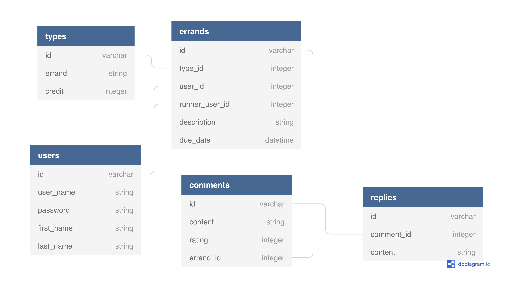

# Module Two Final Project: Errand Runner

#User Guidelines

* As a user, I want to be able to login and create an errand. 
* As a user, I want to be able to login and run others errand.
* As a user, I want to be able to comment on the completed errand that I've posted. The errand runner is able to reply to my comment.
* As a user, I want to be able to update my information.
* As a user, I want to be able to logout from the application.

### TECHNICAL OBJECTIVES

1. This application accesses a Sqlite3 Database using ActiveRecord.
2. This application has five models including one join model. See ER Diagram for more details.
3. This application has five separate classes for the models.

### SET UP FOR CLI APPLICATION 
  
1.) Make sure Ruby is installed by opening your terminal and typing:

ruby -v

2.) It should return this:

ruby 2.6.1p33 (2019-01-30 revision 66950) [x86_64-darwin18] or higher

If you don't have ruby installed, you'll have to get that up and running in your machine first. You can do that by going to the Official Ruby Language Downloads page and following the instructions to download and install ruby on your computer.

3.) Download this repository.

4.) Run rails s to start your web server.

5.) Use URL localhost:3000 to view your application.
